# 📍AI vs Machine Learning vs Deep learing
## AI (Artificial Intelligence) 🤖
> **นิยาม:** การสร้างระบบหรือโปรแกรมที่สามารถคิด วิเคราะห์ หรือแก้ปัญหาได้เหมือนมนุษย์  
> **ตัวอย่าง:** การจดจำเสียง, การแปลภาษา, การเล่นเกม

---

## ML (Machine Learning) 🖥
> **นิยาม:** สาขาหนึ่งของ AI ที่เน้นให้คอมพิวเตอร์เรียนรู้จากข้อมูล โดยไม่ต้องเขียนโปรแกรมทุกขั้นตอน  
> **ตัวอย่าง:** ทำนายราคาหุ้นจากข้อมูลในอดีต

---

## DL (Deep Learning) 🧠
> **นิยาม:** เทคนิคใน ML ที่ใช้โครงข่ายประสาทเทียมหลายชั้น (Neural Networks) เพื่อเรียนรู้ข้อมูลที่ซับซ้อน  
> **ตัวอย่าง:** รู้จำภาพ เสียง หรือข้อความ

---

# 📍PEAS 🤖

> โมเดลนิยามปัญหา AI ประกอบด้วย 4 องค์ประกอบหลัก

| องค์ประกอบ | ความหมาย | ตัวอย่าง |
|---|---|---|
| **Performance measure (P)** ⏱ | ตัวชี้วัดความสำเร็จ | ความแม่นยำ, ความเร็ว |
| **Environment (E)** 🌳 | สภาพแวดล้อมที่ระบบทำงาน | ห้อง, โลกจริง, ข้อมูล |
| **Actuators (A)** 👻 | ตัวกระทำ/อุปกรณ์ตอบสนอง | แขนกล, ล้อ, หน้าจอ |
| **Sensors (S)** 📝 | ตัวรับข้อมูล/เซ็นเซอร์ | กล้อง, ไมโครโฟน, เซ็นเซอร์วัดอุณหภูมิ |

### ตัวอย่าง PEAS: Vacuum Cleaner

```text
Vacuum cleaner (PEAS)

# Performance measure
- cleanness

# Environment
- dust, floor, wall, door, room number (A or B)

# Actuators
- vacuum cleaner movement, suck

# Sensors
- dust sensors, GPS
```

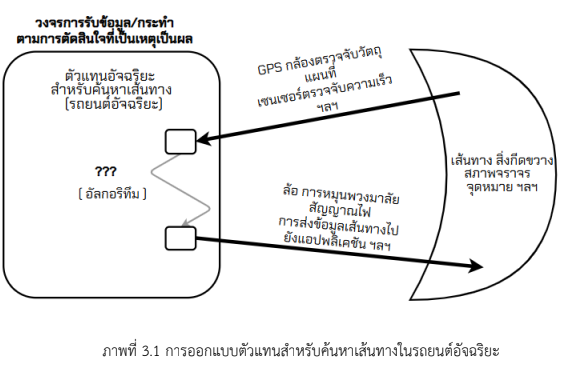

---

## ประเภทของสภาพแวดล้อม AI

| ประเภท | คำอธิบาย | ตัวอย่าง |
|---|---|---|
| **Fully observable** | agent มองเห็นสถานะโลกทั้งหมด | เกมหมากรุก |
| **Partially observable** | agent มีข้อมูลไม่ครบ | รถยนต์ขับเคลื่อนอัตโนมัติ |
| **Deterministic** | ผลลัพธ์แน่นอน | คำนวณทางคณิตศาสตร์ |
| **Stochastic** | ผลลัพธ์สุ่ม/ไม่แน่นอน | ทำนายสภาพอากาศ |
| **Episodic** | งานแบ่งเป็นตอนสั้น ๆ | จำแนกรูปภาพ |
| **Sequential** | การตัดสินใจมีผลต่ออนาคต | หุ่นยนต์เดินทาง |
| **Static** | โลกไม่เปลี่ยนแปลงขณะ agent คิด | ตรวจสอบภาพนิ่ง |
| **Dynamic** | โลกเปลี่ยนแปลงตลอดเวลา | แข่งรถสด |
| **Discrete** | สถานะ/การกระทำจำกัด | เกมกระดาน |
| **Continuous** | สถานะ/การกระทำต่อเนื่อง | ควบคุมแรงบิดมอเตอร์ |
| **Single-agent** | agent เดียว | ระบบแนะนำสินค้า |
| **Multi-agent** | หลาย agent โต้ตอบกัน | เกมหลายผู้เล่น |

---

## Agent
- ตัวแทนที่รับข้อมูลจากสภาพแวดล้อม ประมวลผล และตอบสนอง

## Autonomy
- ความสามารถของ agent ในการเลือกแนวทางปฏิบัติอย่างอิสระเพื่อบรรลุเป้าหมาย

---

# Problem-solving search agent

## Uninformed search

### Depth First Search (DFS)
- สำรวจเส้นทางให้ลึกที่สุดก่อน แล้วค่อยย้อนกลับไปสำรวจทางเลือกอื่น

---

[THANK P'TaiChi ☆*: .｡. o(≧▽≦)o .｡.:*☆](https://github.com/TaiChi112)

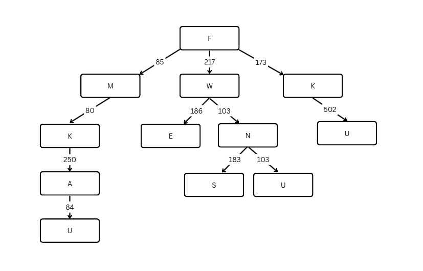
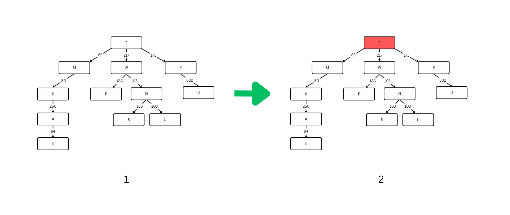
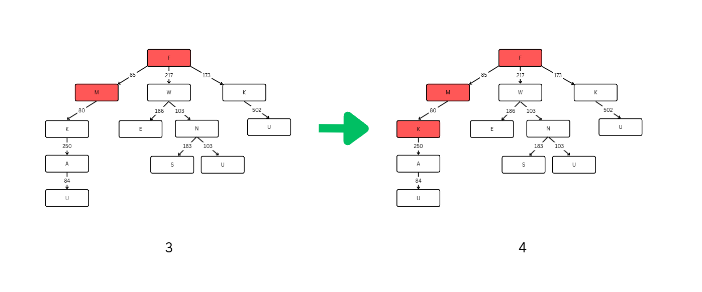
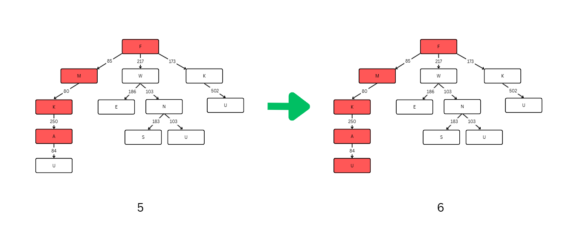

---

### Breadth First Search (BFS)
- เดินแนวนอนในโครงสร้างต้นไม้ ใช้คิว (Queue) ในการเก็บสถานะที่รอสำรวจ  
- เหมาะกับปัญหาที่ต้องการหาคำตอบที่ใช้ขั้นตอนน้อยที่สุด หรือเส้นทางสั้นที่สุด

---


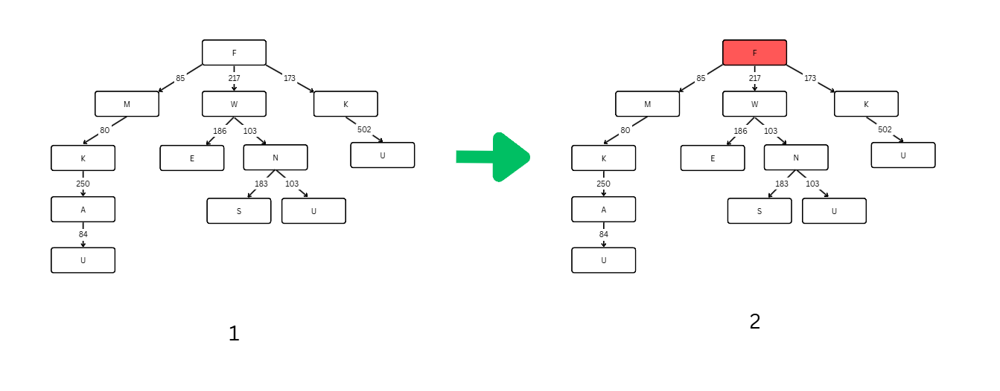
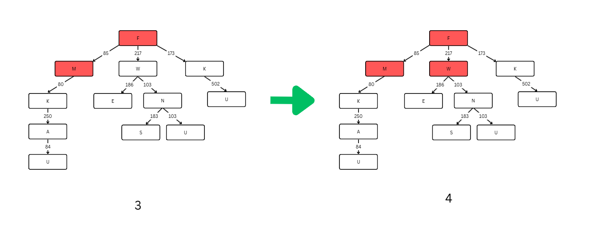
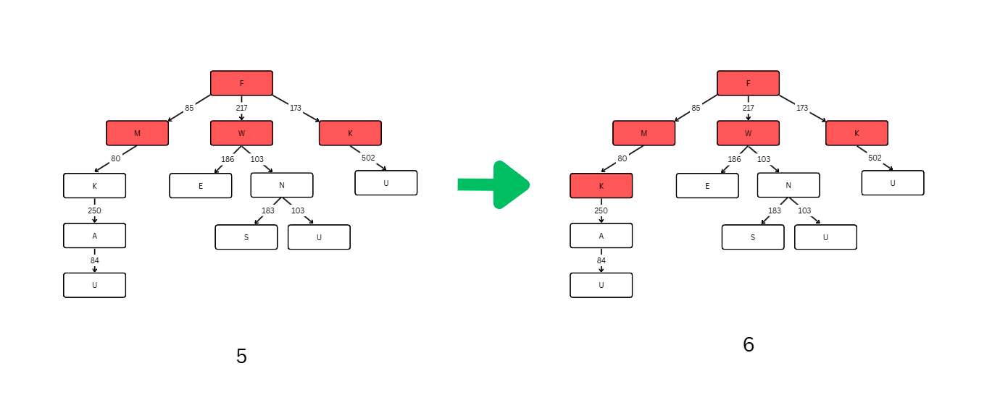
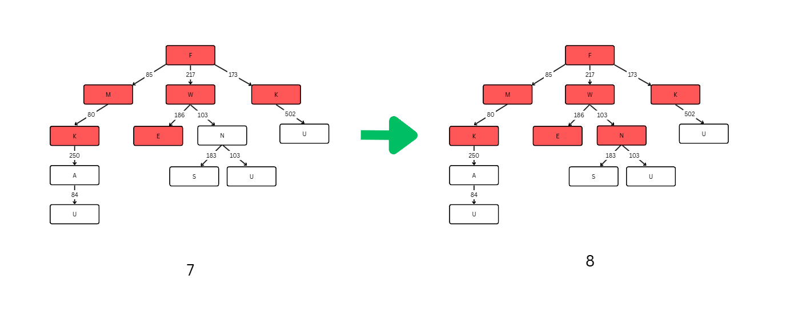
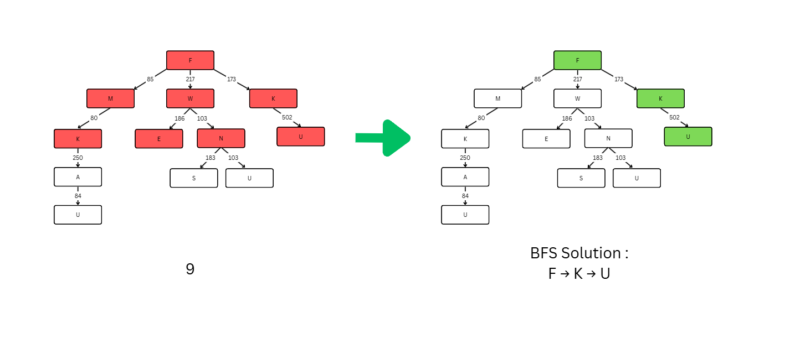

---

### Uniform Cost Search (UCS)
- เลือกเส้นทางที่มีต้นทุนสะสมต่ำที่สุด

---

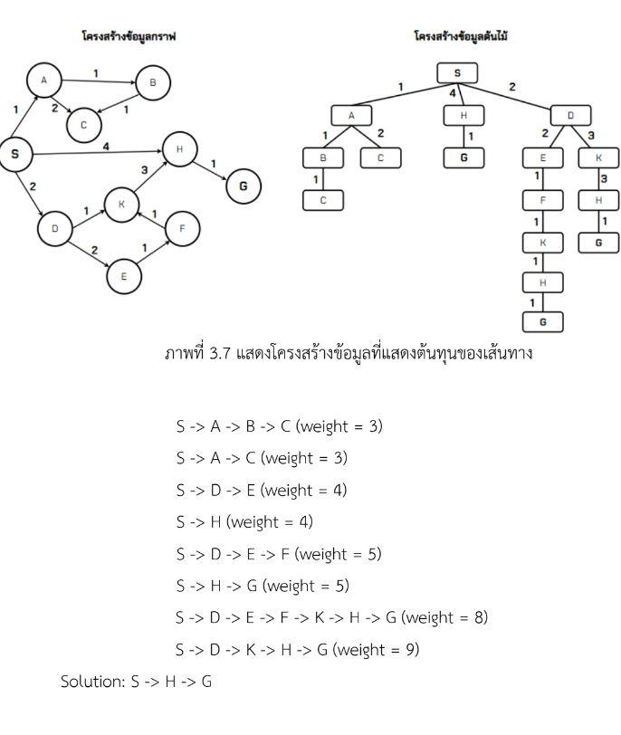

---

## Informed search

### Greedy Best-First Search
- ใช้ heuristic (h(n)) เลือกเส้นทางที่ดูดีที่สุดในแต่ละขั้นตอน

---


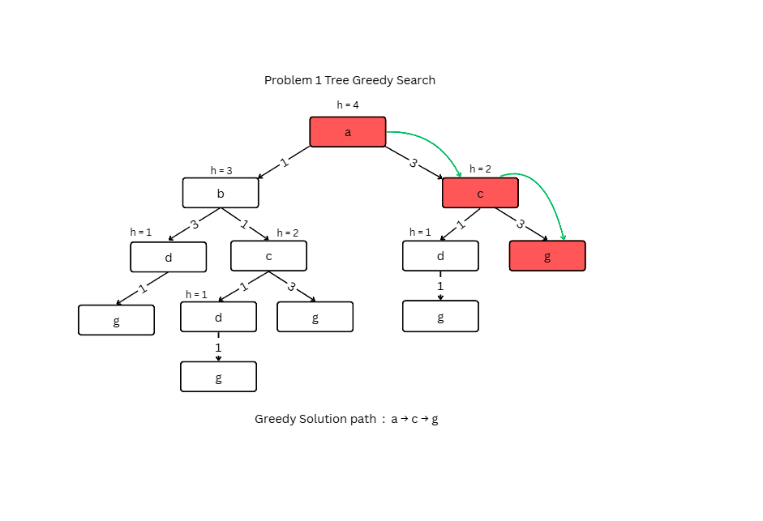

---

### A* search
- ผสมค่าต้นทุนจากจุดเริ่มต้น (g(n)) และค่าประมาณถึงเป้าหมาย (h(n))  
- $f(n) = g(n) + h(n)$

---

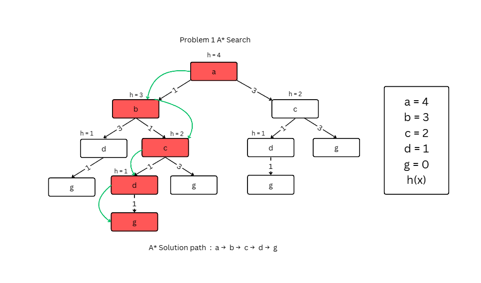

---

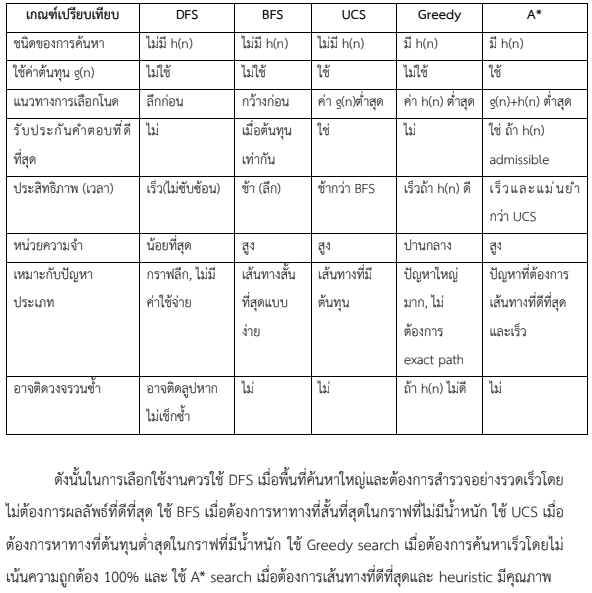

---

# Machine Learning

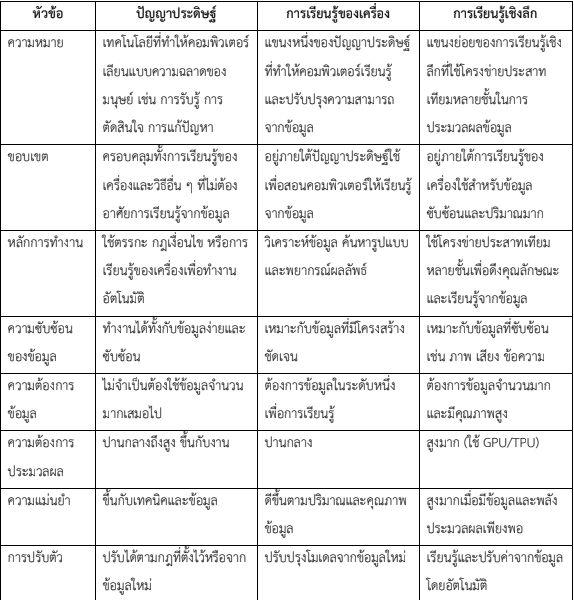

## Terminology — คำศัพท์สำคัญ

| คำศัพท์ | ความหมาย |
|---|---|
| **Dataset** | ชุดข้อมูลสำหรับฝึก/ทดสอบโมเดล |
| **Fitting** | การปรับพารามิเตอร์โมเดลให้พอดีกับข้อมูลฝึก |
| **Feature** | ตัวแปรหรือลักษณะที่นำเข้าให้โมเดลใช้ |
| **Generalisation** | ความสามารถโมเดลในการทำงานกับข้อมูลใหม่ |
| **Model** | โครงสร้างหรือฟังก์ชันที่เรียนรู้การแมปอินพุตไปเอาต์พุต |
| **Hyperparameters** | พารามิเตอร์ที่ตั้งก่อนการฝึก เช่น อัตราการเรียนรู้ |
| **Loss** | ฟังก์ชันวัดความผิดพลาดของโมเดล |
| **Overfitting** | โมเดลเรียนรู้รายละเอียดข้อมูลฝึกมากเกินไป |

---

# การเรียนรู้แบบมีผู้สอน (Supervised Learning)

- ใช้ข้อมูลตัวอย่างที่มีป้ายกำกับ (label)

## Fitting — Underfitting / Appropriate-fitting / Overfitting

| สถานะ | คำอธิบาย |
|---|---|
| **Underfitting** | โมเดลเรียบง่ายเกินไป จับรูปแบบข้อมูลไม่ได้ |
| **Appropriate-fitting** | โมเดลจับรูปแบบสำคัญได้ ผลลัพธ์ดีทั้งฝึกและทดสอบ |
| **Overfitting** | โมเดลซับซ้อนเกินไป ผลดีบนฝึกแต่แย่บนข้อมูลใหม่ |

---

## Output of supervised learning & ตัวอย่างอัลกอริทึม

- **Classification:** เอาต์พุตเป็นคลาส เช่น 'spam'/'not spam'
- **Regression:** เอาต์พุตเป็นตัวเลขต่อเนื่อง เช่น ราคาบ้าน

**ตัวอย่างอัลกอริทึม:**
- Support Vector Machines (SVM)
- Linear Regression
- Naïve Bayes
- Decision Trees
- K-Nearest Neighbors (K-NN)
- Etc.

---

# Unsupervised Learning (การเรียนรู้แบบไม่มีผู้สอน)

- ได้รับเฉพาะข้อมูลอินพุต (ไม่มีป้ายกำกับ)  
- เป้าหมาย: ค้นหาโครงสร้างหรือความรู้ซ่อนเร้นในข้อมูล

**เทคนิคหลัก:**
- Clustering (การจัดกลุ่ม)
- Dimensionality reduction (ลดมิติ)
- Latent variable models (โมเดลตัวแปรซ่อน)
- Density estimation (ประมาณความหนาแน่น)
- Anomaly detection (ตรวจจับค่าผิดปกติ)

### Association (ค้นหากฎความสัมพันธ์)
> ค้นหากฎหรือรูปแบบที่มักเกิดร่วมกัน เช่น ถ้าซื้อ 'ขนมปัง' มักซื้อ 'เนย' ด้วย

### Anomaly detection (ตรวจจับความผิดปกติ)
> ระบุจุดข้อมูลที่ผิดปกติหรือหายาก เช่น ตรวจจับการทุจริต

### Dimensionality reduction (ลดมิติ)
> ลดจำนวนฟีเจอร์เพื่อการแสดงผลและประสิทธิภาพ เช่น ลด noise, ป้องกัน overfitting

---

# Semi-supervised learning (การเรียนรู้กึ่งมีผู้สอน)
- ผสมข้อมูลที่มีป้ายกำกับน้อยกับข้อมูลไม่มีป้ายกำกับจำนวนมาก

---

## Generative Adversarial Networks (GANs)
- ประกอบด้วย 2 เครือข่ายที่แข่งขันกัน  
	- **Generator:** สร้างตัวอย่างเลียนแบบข้อมูลจริง  
	- **Discriminator:** ตัดสินว่าตัวอย่างเป็นของจริงหรือถูกสร้างขึ้น

---

## Reinforcement Learning (การเรียนรู้แบบเสริมกำลัง)
- ให้รางวัลเพื่อเสริมพฤติกรรมที่ต้องการ  
- เรียนรู้จากผลตอบรับและการลองผิดลองถูก

**อัลกอริทึมสำคัญ:**
- Q-Learning
- SARSA
- Deep Q Networks (DQN)
- Deep Deterministic Policy Gradient (DDPG)

**การใช้งาน:** เกมส์ (AlphaGo, Atari), หุ่นยนต์, การจัดสรรทรัพยากร

---

## Joint distribution (ตัวอย่าง)

## Table
| Cookies   | Semester | P(C,S) |
|-----------|---------|--------|
| in-stock  | fall    | 0.10   |
| in-stock  | spring  | 0.20   |
| in-stock  | summer  | 0.30   |
| sold-out  | fall    | 0.25   |
| sold-out  | spring  | 0.10   |
| sold-out  | summer  | 0.05   |


## Marginalization (Find P(C))

**Formula:**  
$$P(\mathrm{x} = x) = \displaystyle\sum_{y \in \mathrm{Y}} P(x, y)$$

### วิธีทำ

$$\begin{align*}
P(in-stock) &= \frac{P(in-stock,S)}{N} \\
& = \frac{0.1+0.2+0.3}{1}  \\
& = 0.6
\end{align*}$$

### วิธีทำ

$$\begin{align*}
P(sold-out) &= \frac{P(sold-out,S)}{N} \\
& = \frac{0.25+0.1+0.15}{1}  \\
& = 0.4 \\\\\\
\end{align*}$$

| Cookies   | P(C)  |
|-----------|-------|
| in-stock  | 0.6   |
| sold-out  | 0.4   |

## Marginalization (Find P(S))


### วิธีทำ

$$\begin{align*}
P(fall) &= \frac{P(C,fall)}{N} \\
& = \frac{0.1+0.25}{1}  \\
& = 0.35 \\
\end{align*}$$

### วิธีทำ

$$\begin{align*}
P(spring) &= \frac{P(C,spring)}{N} \\
& = \frac{0.2+0.1}{1}  \\
& = 0.3 \\
\end{align*}$$

### วิธีทำ

$$\begin{align*}
P(summer) &= \frac{P(C,summer)}{N} \\
& = \frac{0.3+0.05}{1}  \\
& = 0.35 \\\\\\
\end{align*}$$

| Semester | P(S)  |
|----------|-------|
| fall     | 0.35  |
| spring   | 0.3   |
| summer   | 0.35  |

# find P(sold-out | fall)
### วิธีทำ

$$\begin{align*}
P(sold-out\  | \   fall) &= \frac{P(sold-out ,  fall)}{P(  fall)} \\\\
\end{align*}$$

$$\begin{align*}
P(sold-out\ | \  fall) &= \frac{P(0.25)}{P(0.35)} \\\\
&= 0.714 \\\\
\end{align*}$$

# P(spring)

### วิธีทำ

$$\begin{align*}P(spring) &= \frac{0.30}{1} \\\\
&= 0.3 \\\\
\end{align*}$$

# Normalization table

**Formula:**  
$$P(\mathrm{A} = a|b) = \displaystyle \frac{P(a,b)}{P(b)}$$

### 1. find conditional probability ของ P(Cookies | Semester)

$$\begin{align*} \\
P(in-stock,fall) &= \frac{P(in-stock,fall)}{P(fall)} \\\\
& = \frac{0.1}{0.35}  \\\\
& = 0.29 \\\\
\end{align*}$$

---

$$\begin{align*} \\
P(in-stock,spring) &= \frac{P(in-stock,spring)}{P(spring)} \\\\
& = \frac{0.2}{0.3}  \\\\
& = 0.67 \\\\
\end{align*}$$

---

$$\begin{align*} \\
P(in-stock,summer) &= \frac{P(in-stock,summer)}{P(summer)} \\\\
& = \frac{0.3}{0.35}  \\\\
& = 0.86 \\\\
\end{align*}$$

---

$$\begin{align*} \\
P(sold-out,fall) &= \frac{P(sold-out,fall)}{P(fall)} \\\\
& = \frac{0.25}{0.35}  \\\\
& = 0.71 \\\\
\end{align*}$$

---

$$\begin{align*} \\
P(sold-out,spring) &= \frac{P(sold-out,spring)}{P(spring)} \\\\
& = \frac{0.1}{0.3}  \\\\
& = 0.33 \\\\
\end{align*}$$

---

$$\begin{align*} \\
P(sold-out,summer) &= \frac{P(sold-out,summer)}{P(summer)} \\\\
& = \frac{0.05}{0.35}  \\\\
& = 0.14 \\\\
\end{align*}$$

---

| Cookies   | Semester | P(C|S) | Normalization |
|-----------|---------|--------|---------------|
| in-stock  | fall    | 0.29   | 0.10          |
| in-stock  | spring  | 0.67   | 0.20          |
| in-stock  | summer  | 0.86   | 0.30          |
| sold-out  | fall    | 0.71   | 0.25          |
| sold-out  | spring  | 0.33   | 0.10          |
| sold-out  | summer  | 0.14   | 0.15          |

---
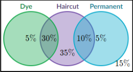
### **Formula** Conditional Probability
```in เซต```
$$P(A \mid B) = \frac{P(A \cap B)}{P(B)}$$ 
```in ความน่าจะเป็น```
$$P(A \mid B) = \frac{P(A , B)}{P(B)}$$ 
---
$$P(A,B) = P(A \cap B)$$
---
 ```วิธีทำ```
```P(Haircut| Permanent)```

$$P(\text{Haircut} \mid \text{Permanent}) = \frac{P(Haircut \cap Permanent)}{P(Permanent)} = \frac{0.10}{0.15} \approx 0.667$$
---
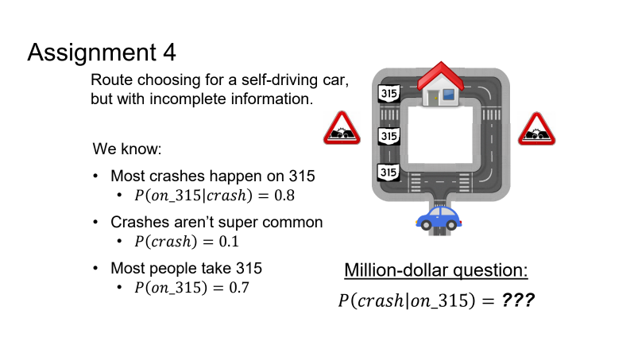
---
### Bayes’ Rule
$$P(a \mid b) = \frac{P(b \mid a)P(a)}{P(b)}$$
### We know:
$$P(on-315 \mid crash) = 0.8$$
$$P(crash) = 0.1 $$
$$P(on-315) = 0.7$$
### วิธีทำ
$$P(crash \mid on-315) = \frac{P(on-315 \mid crash)P(crash)}{P(on-315)}$$
### แทนค่า
$$\begin{align*}
P(\text{crash} \mid \text{on-315}) 
&= \frac{P(0.8 * 0.1)}{P(0.7)} \\
&= \frac{0.8}{0.7} \\
& \approx 0.114
\end{align*}$$
